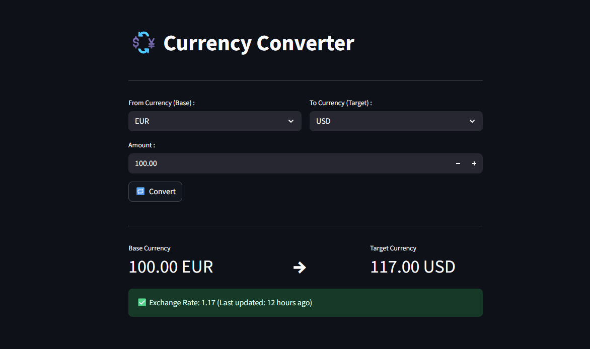

# 💱 Currency Converter

A modern, minimalistic **Currency Converter** web app built with [Streamlit](https://streamlit.io/),  
using real-time data from the [ExchangeRate API](https://www.exchangerate-api.com/).  
It allows you to **select currencies, enter an amount, and instantly get conversions** with live exchange rates.

---

## ✨ Features
- 🔄 **Real-Time Conversion** — Live rates from a free API.
- 🌎 **150+ Supported Currencies**.
- ⚡ **Fast & Cached** — Results cached for 5 minutes to reduce API calls.
- 🕒 **Last Updated Info** — Shows how recently the rate was updated (e.g., “3 minutes ago”).
- 🎨 **Clean, Responsive UI** with Streamlit.

---

## 📸 Screenshot


---

## 🛠 Installation

### 1️⃣ Clone the Repository
```bash
git clone https://github.com/manixko/Currency-Converter.git
cd Currency-Converter
```
### 2️⃣ Install Dependencies
Make sure Python 3.8+ is installed, then:
```bash
pip install -r requirements.txt
```

## ▶️ How to Use
Run the Streamlit App:
```bash
streamlit run src/app.py
```
Open in your Browser at:
```arduino
http://localhost:8501
```
